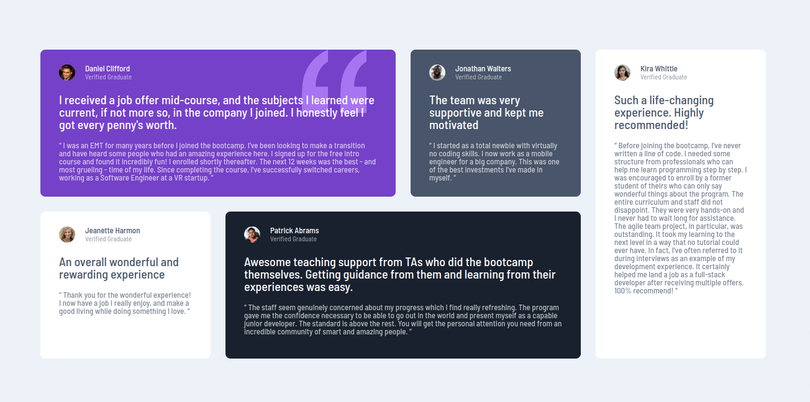

# Frontend Mentor - Testimonial grid section

This is a solution to the [Testimonial grid section](https://www.frontendmentor.io/challenges/testimonials-grid-section-Nnw6J7Un7).

## Table pf contents

- [Frontend Mentor - Testimonial grid section](#frontend-mentor---testimonial-grid-section)
  - [Table pf contents](#table-pf-contents)
  - [Overview](#overview)
    - [Solution screenshot](#solution-screenshot)
    - [Links](#links)
  - [My process](#my-process)
    - [Built with](#built-with)
    - [Layout](#layout)
    - [What I learned](#what-i-learned)
    - [Questions](#questions)
    - [Author](#author)
  - [Acknowledgments](#acknowledgments)

## Overview

In the source code you will find what I consider the bare minimum markup and styles to solve this challenge, with the addition of some landmark roles to comply with Accessibility best practices.

This solution started with a mobile-first approach and it contains responsive adjustment to spacing without modifying font sizes.

### Solution screenshot



### Links

Sandboxes with the solution are available at the following links:

- View it on GitHub Pages: [Live Solution](https://efabrizio75.github.io/frontend-mentor-challenges/junior/testimonials-grid-section-main/)

## My process

Final testing includes running axe DevTools extension to check for accessibility issues, with best practices option turned on.

### Built with

- Visual Studio Code
- Semantic HTML5
- CSS3
- Mobile-first workflow
- axe-core 4.10

### Layout

The basic layout of the entire sections containing cards is this:

```html
 <div id="testimonials-section">
  <section class="testimonial">
    <div class="avatar-container">
      
      <h2 />
      <h3 class="smaller" />
    </div>
    <p class="x-large" />
    <blockquote />
  </section>
</div>
```

### What I learned

1. I learned how to play with `grid` and `flex` layouts in order to achieve the intended result.
1. I favored an accessible approach for the choice of elements to use, and opted for the `section` tag instead of just a `div` or a `ul`.

### Questions

1. I like to keep the attribution section in all my challenges, but I noticed it interferes with the screenshot. What solution would you suggest?

### Author

- Website - [efabrizio](https://www.efabrizio.com)
- GitHub - [efabrizio75](https://github.com/efabrizio75)
- Frontend Mentor - [@efabrizio75](https://www.frontendmentor.io/profile/efabrizio75)
- LinkedIn - [efabrizio](https://www.linkedin.com/in/efabrizio/)

## Acknowledgments

Obviously, there wouldn't be this file without the wonderful idea that is Frontendmentor.io. Thank you guys!
