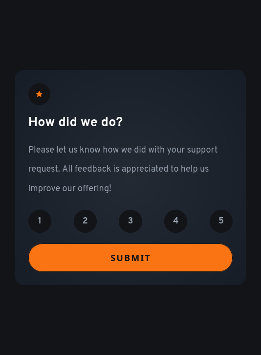

# Frontend Mentor - Interactive rating component

This is a solution to the [Interactive rating component](https://www.frontendmentor.io/challenges/interactive-rating-component-koxpeBUmI).

## Table of contents

- [Frontend Mentor - Interactive rating component](#frontend-mentor---interactive-rating-component)
  - [Table of contents](#table-of-contents)
  - [Overview](#overview)
    - [Solution screenshot](#solution-screenshot)
    - [Links](#links)
  - [My process](#my-process)
    - [Built with](#built-with)
    - [What I learned](#what-i-learned)
    - [Questions](#questions)
  - [Learning Resources](#learning-resources)
    - [Author](#author)
  - [Acknowledgments](#acknowledgments)

## Overview

In the source code you will find what I consider the bare minimum markup and styles to solve this challenge, with the addition of some landmark roles to comply with Accessibility best practices.

This solution started with a mobile-first approach and it contains responsive adjustment to spacing without modifying font sizes.

### Solution screenshot

### Links

Sandboxes with the solution are available at the following links:

- View it on GitHub Pages: [Live Solution](https://efabrizio75.github.io/frontend-mentor-challenges/newbie/interactive-rating-component-main/)

## My process

Final testing includes running axe DevTools extension to check for accessibility issues, with best practices option turned on.

Responsive design tested via Responsively app, and Firefox DevTools.

### Built with

- Visual Studio Code
- Semantic HTML5
- CSS3
- Mobile-first workflow
- axe-core 4.10

### What I learned

1. I learned to simplify the number of containers needed to achieve a "centered" look for the overall component.
2. I learned to style the `:focus` and `:focus-visible` state of an element and their impact on accessibility.
3. I learned more about the advantages of using the `classList` property to manipulate the `class` attribute of an element.

### Questions

1. I would like to see how others implemented the radio buttons while maintaining full keyboard functionality.

---
## Learning Resources

I utilized the following resources while completing this challenge, but it doesn't mean that I implemented all techniques and approaches.

- [Adobe Color - Accessibility Tools](https://color.adobe.com/create/color-contrast-analyzer)
- [Pure CSS Styles Radio Buttons](https://moderncss.dev/pure-css-custom-styled-radio-buttons/)
---

### Author

- Website - [efabrizio](https://www.efabrizio.com)
- GitHub - [efabrizio75](https://github.com/efabrizio75)
- Frontend Mentor - [@efabrizio75](https://www.frontendmentor.io/profile/efabrizio75)
- LinkedIn - [efabrizio](https://www.linkedin.com/in/efabrizio/)
---

## Acknowledgments

Obviously, there wouldn't be this file without the wonderful idea that is Frontendmentor.io. Thank you guys!
