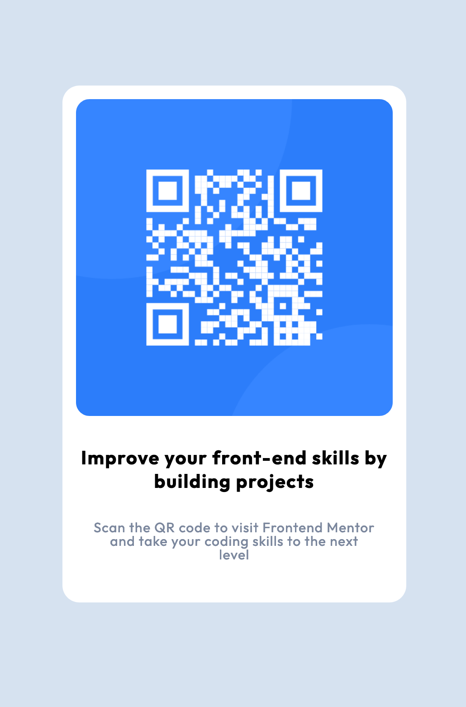

# Frontend Mentor - QR code component solution

This is a solution to the [QR code component challenge on Frontend Mentor](https://www.frontendmentor.io/challenges/qr-code-component-iux_sIO_H).

## Table of contents

- [Frontend Mentor - QR code component solution](#frontend-mentor---qr-code-component-solution)
  - [Table of contents](#table-of-contents)
  - [Overview](#overview)
    - [Solution Screenshot](#solution-screenshot)
    - [Links](#links)
  - [My process](#my-process)
    - [Built with](#built-with)
    - [Layout](#layout)
    - [What I learned](#what-i-learned)
  - [Author](#author)
  - [Acknowledgments](#acknowledgments)

## Overview

In the source code you will find what I consider the bare minimum markup and styles that I came up with to solve the challenge, with the addition of some landmark roles to comply with Accessibility best practices.

### Solution Screenshot



### Links

Sandboxes with the solution are available at the following links:

- View it on Repl.it: [Live solution](https://qr-code-solution.emanuelef75.repl.co/)
- View it on Codepen: [Live solution](https://codepen.io/Emanuele-Fabrizio/live/RwqXMVd)

## My process

### Built with

- Visual Studio Code
- Semantic HTML5
- CSS
- Mobile-first workflow
- axe-core 4.6.3

### Layout

The basic layout in which the QR code is rendered follows this markup:

```html
<div id="qr-card">
  <div class="container">
    
    <p class="tagline"></p>
    <p class="info"></p>
  </div>
</div>
```

### What I learned

I learned how to use Repl.it to host my solutions even though I had selected Codepen.io at first. I also learned how to center vertically the QR component container using flexbox rules.
Additionally, I enjoyed the fact that the Frontendmentor.io checks the provided solution for accessibility best practices.

## Author

- Frontend Mentor - [@efabrizio75](https://www.frontendmentor.io/profile/efabrizio75)
- Vercel space - [Work in progress](https://vercel-tmpl-react.vercel.app/)
- Netlify space - [Work in Progress](https://factotum-jammming.netlify.app/)

## Acknowledgments

Obviously, there wouldn't be this file without the wonderful idea that is Frontendmentor.io. Thank you guys!
