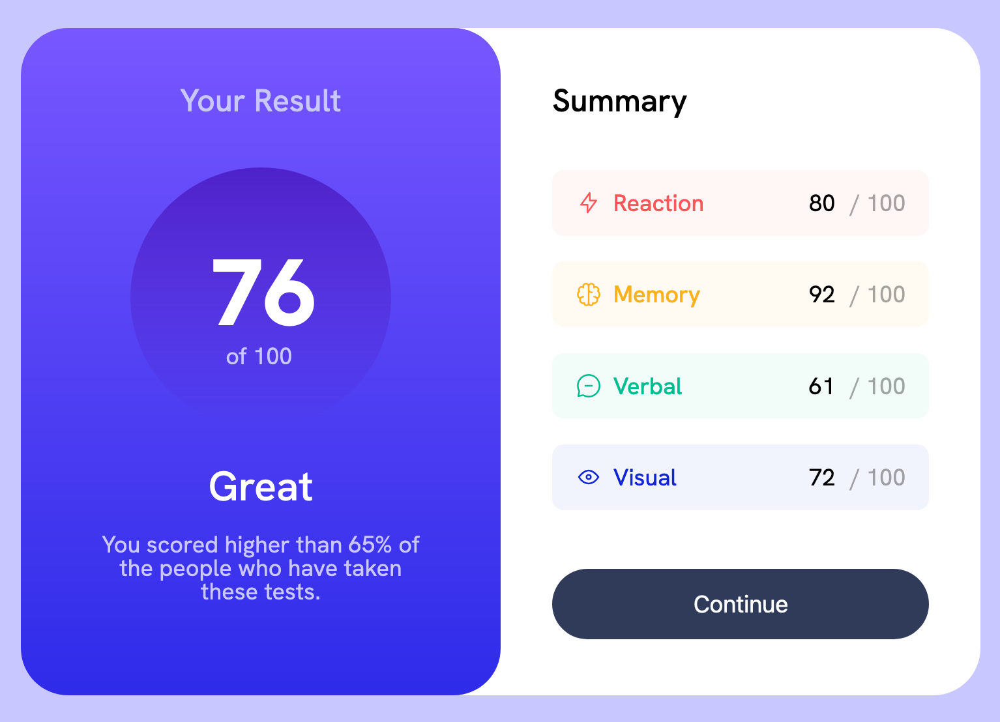

# Frontend Mentor - Results summary component solution

This is a solution to the [Results summary component challenge on Frontend Mentor](https://www.frontendmentor.io/challenges/results-summary-component-CE_K6s0maV/hub).

## Table of contents

- [Frontend Mentor - Results summary component solution](#frontend-mentor---results-summary-component-solution)
  - [Table of contents](#table-of-contents)
  - [Overview](#overview)
    - [Solution Screenshot](#solution-screenshot)
    - [Links](#links)
  - [My process](#my-process)
    - [Built with](#built-with)
    - [Layout](#layout)
    - [What I learned](#what-i-learned)
    - [Questions](#questions)
  - [Author](#author)
  - [Acknowledgments](#acknowledgments)

## Overview

In the source code you will find what I consider the bare minimum markup and styles that I came up with to solve the challenge, with the addition of some landmark roles to comply with Accessibility best practices.

### Solution Screenshot



### Links

Sandboxes with the solution are available at the following links:

- View it on Repl.it: [Live solution](https://femioresults-summary-component.emanuelef75.repl.co)
- View it on Codepen: [Live solution](https://codepen.io/Emanuele-Fabrizio/live/mdabKRw)

## My process

Final testing includes running axe DevTools extension to check for accessibility issues, with best practices option turned on.

### Built with

- Visual Studio Code
- Semantic HTML5
- CSS3
- Mobile-first workflow
- axe-core 4.6.3

### Layout

The basic layout in which the Results summary component code is rendered follows this markup:

```html
<div id="results-panel">
  <section class="summary">
    <div>
      <h1>Results</h1>
      <p class="score-box">
      <p class="score-grade">
      <p class="score-rank">
  <section class="details">
    <div>
      <h2>Summary></h2>
      <p class="..."> * 4 times
      <button>
</div>
```

The layout consists of a main panel with two panes: the summary and the details. The mail panel uses flexbox to place the panes in a column by default, switching to a row when the viewport is greater than 736px.

Each pane is considered a section, with a div wrapping up the respective contents.

### What I learned

I learned how to use line-height property to vertically center text (no line breaks) within a container by setting its value equal to that of the height property in the same container.
I learned the correspondence between rgb() --> rgba() and hsl() --> hsla().
I learned the importance of choosing and using the more appropriate unit of measurement for responsive design.

### Questions

1. In the Summary pane, what is the most reliable way to make each one of the values in the category stay without wrapping even while the user resizes the viewport?
2. What's another approach to display the results in the "circle gradient"?

## Author

- Frontend Mentor - [@efabrizio75](https://www.frontendmentor.io/profile/efabrizio75)
- LinkedIn - [efabrizio](https://www.linkedin.com/in/efabrizio/)
- Vercel space - [Work in progress](https://vercel-tmpl-react.vercel.app/)
- Netlify space - [Work in Progress](https://factotum-jammming.netlify.app/)

## Acknowledgments

Obviously, there wouldn't be this file without the wonderful idea that is Frontendmentor.io. Thank you guys!
