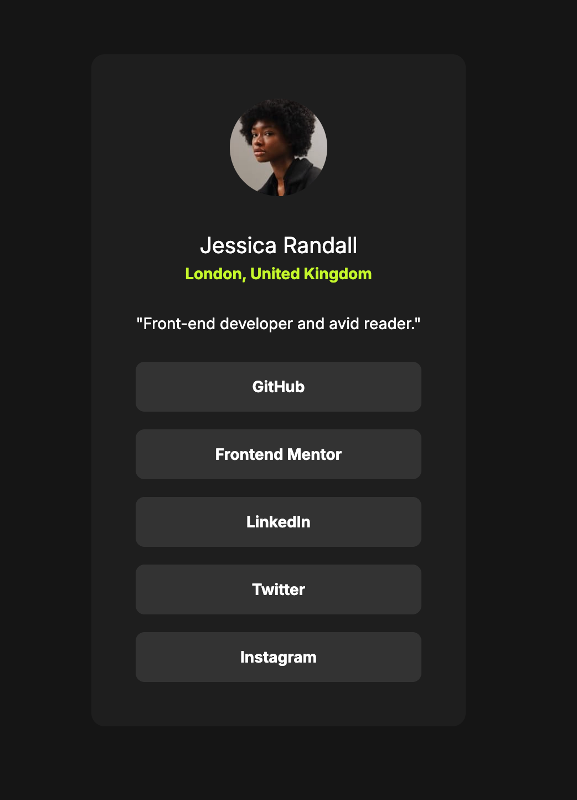

# Frontend Mentor - Social links profile

This is a solution to the [Social links profile](https://www.frontendmentor.io/challenges/social-links-profile-UG32l9m6dQ).

## Table pf contents

- [Frontend Mentor - Social links profile](#frontend-mentor---social-links-profile)
  - [Table pf contents](#table-pf-contents)
  - [Overview](#overview)
    - [Solution screenshot](#solution-screenshot)
    - [Links](#links)
  - [My process](#my-process)
    - [Built with](#built-with)
    - [Layout](#layout)
    - [What I learned](#what-i-learned)
    - [Questions](#questions)
    - [Author](#author)
  - [Acknowledgments](#acknowledgments)

## Overview

In the source code you will find what I consider the bare minimum markup and styles to solve this challenge, with the addition of some landmark roles to comply with Accessibility best practices.

### Solution screenshot



### Links

Sandboxes with the solution are available at the following links:
- View it on GitHub Pages: [Live Solution](https://efabrizio75.github.io/frontend-mentor-challenges/newbie/social-links-profile-main/index.html)

## My process

Final testing includes running axe DevTools extension to check for accessibility issues, with best practices option turned on.

### Built with

- Visual Studio Code
- Semantic HTML5
- CSS3
- Mobile-first workflow
- axe-core 4.10

### Layout

The basic layout in which the product card component is rendered is this:

```html
<div id="blog-entry-preview">
  <div class="container">
    
    <ul class="tags">
      <li class="extra-small">...</li>
    </ul>
    <p class="timestamp extra-small">Published <time>21 Dec 2023</time></p>
    <h1>
    <p class="blurb small">
    <div class="authors">
      <p class="author-bio small">
    </div>
  </div>
</div>
```

### What I learned

1. This was a really simple challenge, but it was still a good opportunity to think about ways to avoid code duplication in the future.
2. I think most of my learning this time was on the way to use Figma to discover where all design information is kept 😃

### Questions


### Author

- Website - [efabrizio](https://www.efabrizio.com)
- GitHub - [efabrizio75](https://github.com/efabrizio75)
- Frontend Mentor - [@efabrizio75](https://www.frontendmentor.io/profile/efabrizio75)
- LinkedIn - [efabrizio](https://www.linkedin.com/in/efabrizio/)

## Acknowledgments

Obviously, there wouldn't be this file without the wonderful idea that is Frontendmentor.io. Thank you guys!
